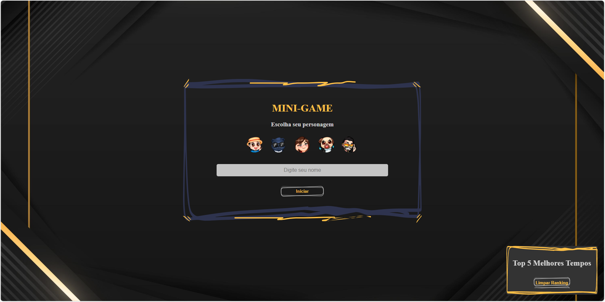
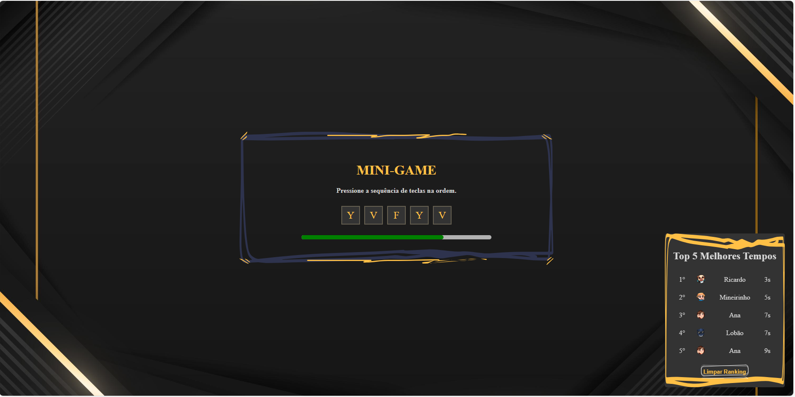
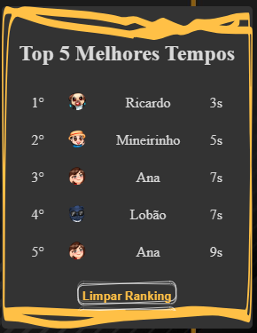

# 🌇 **Cidade Alta | Desafio Front-End "MINI-GAME"**

Este projeto foi desenvolvido como parte de um desafio proposto pela empresa Cidade Alta para uma vaga de desenvolvedor frontend. O Mini-Game é uma aplicação simples desenvolvida em React, criada com o intuito de testar a memória e agilidade do jogador.

### Apresentação do Projeto

O Mini-Game é uma experiência envolvente, projetada para entreter e desafiar os jogadores. Com uma interface simples e intuitiva, o jogo proporciona uma experiência imersiva, permitindo que os usuários testem suas habilidades cognitivas de forma divertida.

### Lógica do Mini-Game
Ao iniciar o jogo, uma sequência aleatória de teclas (por exemplo, letras de A a Z) é gerada e exibida ao jogador. Este deve pressionar as teclas na ordem correta dentro de um tempo limite determinado. O jogador recebe feedback visual imediato para indicar se a tecla pressionada foi correta ou não. Se o jogador pressionar a tecla correta, a próxima tecla da sequência é destacada. No entanto, se o jogador pressionar a tecla errada ou o tempo acabar, o jogo termina e o jogador é notificado sobre seu desempenho.

### Requisitos do Projeto
- Exibição da Sequência Atual: A tela principal exibe a sequência atual de teclas que o jogador precisa pressionar.

- Indicador de Tempo: Um indicador de tempo mostra quanto tempo resta para completar a sequência.

- Feedback Visual: Feedback visual é fornecido para indicar se a tecla pressionada foi correta ou não.

O Mini-Game é mais do que apenas um jogo - é uma oportunidade de demonstrar habilidades técnicas, criatividade e capacidade de resolver problemas de forma eficaz no contexto do desenvolvimento front-end.

---

# Funcionalidades

- **Iniciar o Jogo**: Os jogadores podem iniciar o jogo inserindo seu nome e escolhendo um personagem.
- **Pressionar a Sequência**: Durante o jogo, o jogador deve pressionar a sequência de teclas na ordem correta antes que o tempo acabe.
- **Barra de Progresso**: Uma barra de progresso mostra o tempo restante para o jogador completar a sequência.
- **Feedback Auditivo**: Os jogadores recebem feedback auditivo quando pressionam corretamente ou incorretamente as teclas.
- **Ranking de Melhores Tempos**: Os melhores tempos dos jogadores são registrados e exibidos em um ranking.

# Tecnologias Utilizadas

- **React**: Framework JavaScript para construção de interfaces de usuário.
- **HTML e CSS**: Para estruturação e estilização da aplicação.
- **JavaScript (ES6+)**: Para a lógica e funcionalidades do jogo.
- **LocalStorage**: Para armazenar os melhores tempos dos jogadores.
- **React Hooks**: Utilização de useState, useEffect, useRef para gerenciamento de estados e efeitos colaterais.

# Imagens do Projeto
A seguir, estão algumas imagens que ilustram as funcionalidades do projeto:

- Tela Inicial:

- Tela MiniGame:

- Tela Ranking:

# Como Utilizar

1. **Clonar o Repositório**: Clone este repositório em seu computador utilizando o seguinte comando:

2. Clone este repositório para o seu ambiente local utilizando o comando:
`git clone https://github.com/Ricardo-Rodrigues0/cidadealta-desafio-front-end.git`

3. Navegue até o diretório do projeto:
`cd cidadealta-frontend`

4. Instale as dependências do projeto executando o comando:
`npm install`

5. Após a instalação das dependências, você pode iniciar a aplicação com o comando:
`npm start`

6. O aplicativo estará disponível em seu navegador no endereço `http://localhost:3000`.

Agora você pode explorar e interagir com o aplicativo localmente!

---

Este projeto é uma demonstração das minhas habilidades em desenvolvimento frontend e foi desenvolvido como parte de um desafio para uma vaga de desenvolvedor frontend pela empresa Cidade Alta.